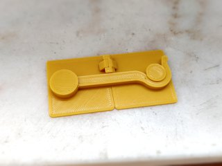
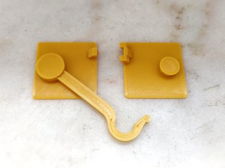
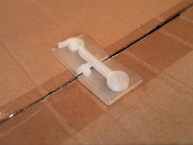
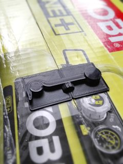
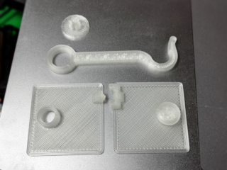

# Customizable Universal Latch
*3D printable latch to keep things like cardboard boxes closed*

### License
[Creative Commons - Attribution](https://creativecommons.org/licenses/by/4.0/)

### Gallery

[🔎](images/photo1.jpg) [🔎](images/photo2.jpg) [🔎](images/photo3.jpg) [🔎](images/photo4.jpg) [🔎](images/photo5.jpg)

## Description and Instructions

This is a simple latch that I originally designed to replace the typical strip of duct tape to keep cardboard boxes closed. This latch is much faster and easier to open and close, and avoids the sticky mess. Of course this can also be used as a latch on anything else, like small doors.

This is a customizable model. Open the .scad file in [OpenSCAD](https://www.openscad.org/) and **[use the OpenSCAD Customizer](https://www.dr-lex.be/3d-printing/customizer.html)** to create a model with your own desired specifications.

Depending on your printer and the material you're using, the latch may be too tight or too sloppy. If this is the case, you can generate and re-print only the latch or cap parts with minor adjustments to the length or tolerances to get a perfect fit.

The default model for which the example STL files are provided, is 35 mm wide and has a 1 mm thick base plate. I haven't tried models at other sizes so I cannot guarantee that the latch will work well at much larger or smaller scales. If you have suggestions to improve the model, remember that this is open source!

### Printing

Any material is suitable although you may want to adjust the amount of perimeters and infill depending on how flexible the material is. For more flexible materials like PETG, I recommend to use 3 perimeters on the latch, for PLA 2 should be OK.

A layer height of 0.2 mm is recommended for all parts except the cap, which is best printed at 0.15 or 0.1 mm layers.

### Mounting

The usual method to mount the latch is by using glue. Mount it closed to ensure correct positioning, but leave it open while the glue cures to avoid sticking the parts together. Make sure the glue will stick to the plastic. It may help to roughen the bottom of the plates with sandpaper to improve adhesion. You could also use double-sided adhesive tape but my experience tells me that this will always detach within due time.

For a more heavy-duty application where the latch is to be mounted on wood, you could also use countersunk screws by generating a model with thicker base plates and either drilling holes or directly printing the model with appropriate hole shapes by editing it in a 3D editor.
